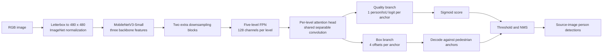

# Person detector training and release workflow

This directory owns the CityPersons binary-person detector from immutable dataset ingestion through FP32 training, metric evaluation, and accuracy-controlled OpenVINO INT8 release. The exported model has one quality-aware person logit per anchor; canonical source labels remain available for sampling and metrics but are not exported as extra heads.

## What is implemented

- Canonical manifest loading with strict schema, checksum, class, and dataset-version validation.
- Aspect-preserving letterbox preprocessing shared by training, PyTorch inference, OpenVINO inference, and INT8 calibration.
- Pedestrian-shaped anchors, ATSS assignment, ignore-region neutralization, GIoU regression, and a one-logit Quality Focal Loss head whose target is aligned IoU.
- Training-only weighted oversampling for small, heavily occluded, rider, sitting, other-person, and unusual-pose records. Validation remains in natural manifest order.
- Project binary-person AP50, AP50:95, Recall@FPPI, and size/source-label/visibility slices.
- Checksum-pinned official CityPersons evaluation for Reasonable, Reasonable-small, heavy-occlusion, and All miss rates.
- Deterministic manifest-driven INT8 calibration with NNCF accuracy control, identical validation records across FP32/FP16/INT8, and core plus end-to-end latency reports.

## Code architecture

The implementation is grouped by responsibility under `person_detection/`. Commands invoke package modules directly; no duplicate compatibility modules are retained.

```text
model_training/
├── person_detection/
│   ├── core/
│   │   └── contracts.py
│   ├── data/
│   │   ├── annotations.py
│   │   ├── dataset.py
│   │   ├── layout.py
│   │   ├── sampling.py
│   │   └── storage.py
│   ├── modeling/
│   │   └── assignment.py
│   ├── training/
│   │   └── pipeline.py
│   ├── evaluation/
│   │   ├── citypersons.py
│   │   └── inference.py
│   └── optimization/
│       └── pipeline.py
├── scripts/
│   └── data/
├── tests/
├── legacy/
├── tools/
└── getCityPersons.sh
```

| Path | Responsibility |
| --- | --- |
| `person_detection/core/` | Abstract inference, evaluation, and optimization boundaries |
| `person_detection/data/` | Canonical annotations, manifest layout, dataset/preprocessing, sampling, and storage |
| `person_detection/modeling/` | `AnchorAssigner` contract and `ATSSAnchorAssigner` |
| `person_detection/training/` | Model/loss definitions and `DetectorTrainingPipeline` |
| `person_detection/evaluation/` | PyTorch/OpenVINO backends, project metrics, and official CityPersons evaluation |
| `person_detection/optimization/` | `ManifestDrivenOpenVINOOptimizer` release pipeline |
| `scripts/data/` | Dataset download, conversion, versioning, upload, and validation implementations |
| `tests/` | Unit and integration regressions |
| `legacy/` | Retained pre-canonical training implementation; it is not imported by the current pipeline |

Abstract classes are used only where implementations are genuinely interchangeable: anchor assignment, manifest selection, inference backends, evaluation backends, and optimization pipelines.

Place new implementation code in the responsibility-specific package and invoke it with `python -m package.module`. Checkpoints, OpenVINO outputs, reports, and validation previews remain at their existing paths and are not part of the Python package.

## Model architecture

The detector remains an SSD-style, anchor-based network with a pretrained MobileNetV3-Small backbone. The changes in this project improve the person-specific anchors, target assignment, confidence semantics, and loss; they do not replace the backbone with a larger model.



At the default 480-pixel input, the five prediction levels are:

| Level | Stride | Feature map | Relative scales | Width/height ratios | Anchors/location | Anchors |
| --- | ---: | ---: | --- | --- | ---: | ---: |
| P2 | 8 | 60×60 | 0.02, 0.04 | 0.15, 0.25, 0.40 | 6 | 21,600 |
| P3 | 16 | 30×30 | 0.06, 0.10 | 0.15, 0.25, 0.40 | 6 | 5,400 |
| P4 | 32 | 15×15 | 0.16, 0.24 | 0.20, 0.33, 0.50 | 6 | 1,350 |
| P5 | 64 | 8×8 | 0.32, 0.48, 0.56 | 0.25, 0.50, 1.00 | 9 | 576 |
| P6 | 128 | 4×4 | 0.64, 0.80, 0.95 | 0.25, 0.50, 1.00 | 9 | 144 |

This produces 29,070 anchors. Ratios are defined as width divided by height, so values below one create the tall shapes expected for pedestrians.

The forward pass returns:

- Classification tensor: `[batch, 29070, 1]`. Each value is a single quality-aware person logit.
- Box tensor: `[batch, 29070, 4]`. Values are center and size offsets relative to an anchor.

Each prediction head applies a depthwise-separable shared convolution, dropout, channel attention, spatial attention, and separate classification and box subnets. The single classification score is trained toward the decoded box's IoU with its assigned person. It therefore represents both “is this a person?” and “how well is the person localized?”. There is no separate quality or attribute head at deployment.

Compared with the legacy checkpoint:

| Legacy model | Current model |
| --- | --- |
| Background/person softmax with two logits per anchor | One sigmoid person-quality logit per anchor |
| Equal negative initialization accidentally implied 50% person probability | Classification bias starts at 1% person probability |
| Several nominally pedestrian anchors were wide | Fine-level anchors are explicitly tall |
| Fixed IoU matching | ATSS assignment during training |
| Smooth-L1 localization | GIoU localization |
| Model format version 1 | Model format version 2 |

ATSS, hard-case sampling, and the losses are training-only changes and add no deployment operations. The one-logit head is slightly smaller than the old two-logit head.

## Start the environment

Run commands from the `camera-software` repository root:

```bash
docker compose -f docker-compose.yml -f compose.training.yml up -d azurite training
```

The training image mounts `model_training/` at `/workspace`. It contains the pinned PyTorch, torchvision, OpenVINO, NNCF, Albumentations, Azure, and Kaggle dependencies.

## Build and publish the canonical dataset

Place a valid `kaggle.json` at the repository root, then run:

```bash
docker compose -f docker-compose.yml -f compose.training.yml exec training ./getCityPersons.sh
```

The script downloads the source images and checksum-pinned official annotations, builds a version such as `datasets/citypersons/vYYYY-MM-DD`, uploads it to Azurite, validates every manifest relation and checksum, renders a preview, and publishes `datasets/citypersons/current.json` last.

Useful controlled overrides are:

```bash
docker compose -f docker-compose.yml -f compose.training.yml exec \
  -e CITYPERSONS_DATASET_VERSION=v2026-09-08.release1 \
  -e CITYPERSONS_WORK_DIR=/workspace/.citypersons-work \
  training ./getCityPersons.sh
```

Keep a work directory when an upload must be resumed. Set `CITYPERSONS_RESUME_UPLOAD=true` on the resume invocation; immutable-prefix protection otherwise rejects accidental replacement.

## Train FP32

```bash
docker compose -f docker-compose.yml -f compose.training.yml exec \
  -e ENABLE_QUANTIZATION=false training python -m person_detection.training.pipeline
```

`DetectorTrainingPipeline` reads the following environment variables:

- `AZURITE_BLOB_ENDPOINT`, `AZURITE_ACCOUNT_NAME`, `AZURITE_ACCOUNT_KEY`, and `AZURITE_CONNECTION_STRING`
- `AZURITE_DATA_CONTAINER` and `AZURITE_MODEL_CONTAINER`
- `USE_AZURITE` (`true` by default) and `DATA_ROOT` for local fallback
- `ENABLE_QUANTIZATION`, which must remain `false`

Model and optimizer hyperparameters live in `TrainingConfig`. Checkpoints contain `modelFormatVersion`, dataset version/checksum/schema provenance, sampling policy, ATSS settings, and head semantics. A compatible checkpoint is reused only when its immutable dataset identity also matches.

The main artifact is `best_model_fp32.pth`; the training pipeline also exports `person_detector_fp32.xml` and `.bin` when OpenVINO is available.

## What the training command does

The default training configuration is:

| Setting | Default | Purpose |
| --- | ---: | --- |
| Input | 480×480 RGB | Letterboxed model canvas |
| Batch size | 32 | Images per optimizer step |
| Epochs | 100 | Complete passes through the sampled training epoch |
| Optimizer | SGD | Updates all trainable parameters |
| Learning rate | 0.001 | Peak/base learning rate |
| Momentum | 0.937 | Smooths SGD updates |
| Weight decay | 0.0001 | Parameter regularization |
| Warm-up | 3 epochs | Ramps the learning rate to 0.001 |
| Later schedule | Cosine decay | Decays toward 0.0001 |
| AMP | Enabled | BF16 on CPU or mixed precision on CUDA |
| Gradient clipping | 10.0 | Caps the total gradient norm |
| ATSS candidates | Top 9 per level | Candidate anchors nearest each person |
| GIoU weight | 2.0 | Scales localization loss |
| Hard-case oversampling | Enabled | Training split only |

Before the first epoch, the pipeline:

1. Connects to Azurite or the configured local data root.
2. Resolves the immutable CityPersons pointer and verifies the dataset manifest.
3. Loads the train and validation split manifests.
4. Fetches three random records from each labelled split and parses their sidecars as a fast smoke check. This catches many storage, schema, and checksum problems, but it is not an exhaustive sidecar validation.
5. Builds training-only sampling weights. A normal record has weight 1.0; small or difficult records can receive a weight up to 4.0. Sampling uses replacement but still draws exactly one dataset-length epoch. Validation is never oversampled.
6. Builds the MobileNetV3/FPN detector, initializes the classification prior to 1%, and generates the anchors.
7. Creates the ATSS/Quality Focal/GIoU loss, SGD optimizer, warm-up schedule, cosine schedule, and AMP gradient scaler.

For the current 2,975-record training manifest and batch size 32, `drop_last=True` produces `floor(2975 / 32) = 92` optimizer steps per epoch. Oversampling changes which records appear in those 92 batches, not the epoch length.

### One optimizer step

For each training batch:

1. Decode the source image and verify it against the canonical sidecar.
2. Clip boundary-crossing boxes to the observable image.
3. Transform full boxes, visible boxes, and ignore regions through the same geometry.
4. Apply letterboxing, normalization, and training augmentation. CoarseDropout changes pixels but deliberately does not shrink or delete target boxes.
5. Run the model to produce one quality logit and four box offsets for every anchor.
6. Run ATSS independently across the five levels:

   - Select the nine nearest anchors per level for every ground-truth person.
   - Calculate the candidate IoU mean plus standard deviation as that person's adaptive threshold.
   - Require the anchor center to be inside the person box.
   - Guarantee a fallback positive for a person with no surviving candidate.
   - Mark anchors that overlap ignore regions as neutral unless they are valid positives.

7. Decode positive boxes and calculate their aligned IoU. A detached IoU value in `[0, 1]` becomes the positive classification target; background targets zero and neutral anchors contribute no classification loss.
8. Calculate Quality Focal Loss over valid anchors and weighted GIoU loss over positive anchors.
9. Add the two losses, backpropagate with AMP scaling, unscale the gradients, clip their norm to 10, and take one SGD step.

The implemented losses are:

- `Cls`: Quality Focal Loss. It trains confidence toward localization IoU rather than a hard person/not-person target. It is summed over valid anchors and normalized by the number of positive anchors.
- `Loc`: `2 × mean(1 − GIoU)` over positive anchors. Zero is perfect. Since GIoU lies between -1 and 1, the weighted localization term is normally between 0 and 4.
- `Loss`: `Cls + Loc`. The printed values can differ by a very small amount because the total and components may be rounded independently under autocast.

At the end of each epoch, the model is evaluated on the natural, non-augmented validation split using the same loss. Warm-up controls the first three epochs; cosine decay advances afterward. The checkpoint is replaced only when validation loss reaches a new minimum. After the final epoch, the best checkpoint—not necessarily the last epoch—is reloaded and exported to OpenVINO FP32.

Training does not calculate AP during every epoch. Per-epoch validation loss chooses the checkpoint cheaply; run the separate evaluation command to measure detection quality before accepting a release.

### Reading the training progress line

For example:

```text
Epoch 1: 7%|...| 6/92 [01:21<18:55, 13.21s/it, Loss=2.2240, Cls=0.0299, Loc=2.1927]
```

| Field | Meaning | What to look for |
| --- | --- | --- |
| `Epoch 1` | Current epoch | Compare completed epochs, not only the first few batches |
| `6/92` | Six optimizer steps completed out of 92 | Confirms data loading and updates are progressing |
| `13.21s/it` | Seconds per batch | Performance measurement, not model quality |
| `Loss` | Running mean of total loss | Should trend downward over multiple epochs |
| `Cls` | Running mean Quality Focal Loss | Must remain finite; its value is not accuracy or probability |
| `Loc` | Running mean weighted GIoU loss | Usually dominates early and should decline as boxes align |

In that example, `Loc=2.1927` is plausible at the start of training. With a weight of two, it corresponds approximately to a mean GIoU near `-0.096`: the initial decoded boxes are poorly aligned but still within the expected range. `Cls=0.0299` is small because focal modulation and the 1% prior suppress easy background anchors. It does not mean 2.99% classification error.

Use trends rather than a universal target:

- Healthy: finite losses, localization loss decreasing, validation loss eventually decreasing, and new best checkpoints appearing.
- Not automatically a problem: training loss temporarily exceeding validation loss, because training has augmentation and hard-case oversampling.
- Investigate: `NaN`/`inf`, localization staying flat for several epochs, validation loss worsening persistently while training loss falls, no positive anchors, or no new best checkpoint for a long interval.
- Do not infer deployment accuracy from loss alone. A lower loss can still produce worse AP at a particular score threshold or worse recall on small and occluded people.

Estimate duration as `batches × seconds/iteration`, then add validation time. At 92 batches and 13.21 seconds per batch, training alone is roughly 20 minutes per epoch or 33 hours for 100 epochs on that CPU.

### Troubleshooting invalid visible boxes

The following failure is a canonical-data contract error, not a model, loss, AMP, or DataLoader failure:

```text
ValueError: objects[19].visibleBoxXYWH must have positive width and height
```

Training reaches this error after the epoch because the complete validation split is loaded only during the validation pass. Worker process 0 is reporting the exception raised by the dataset parser; setting `num_workers=0` may produce a shorter traceback, but it does not fix the data.

A full scan of the currently published `datasets/citypersons/v2026-09-07` manifests found no invalid train objects and exactly one affected validation object:

| Field | Value |
| --- | --- |
| Validation sample index | 140 |
| Image | `images/val/frankfurt/frankfurt_000001_037705_leftImg8bit.png` |
| Object index | 19 |
| Object ID | `frankfurt_000001_037705_leftImg8bit:instance-24019-19` |
| Source label | `pedestrian` |
| Full box XYWH | `[1647, 359, 47, 113]` |
| Visible box XYWH | `[1694, 452, 0, 20]` |

The full detection box is valid. The source visible box has zero width, representing zero measurable visible area for a heavily occluded pedestrian. The canonical builder currently copies that source value and derives a zero visibility fraction, but the strict loader uses a common converter that requires positive dimensions for full, visible, and ignore boxes. The upload validator verifies checksums, counts, and YOLO full boxes but does not parse every canonical coordinate. Finally, the startup smoke check samples only three records per split, so it did not select validation record 140.

The preferred correction is to define degenerate source-visible boxes explicitly in the canonical contract:

1. Continue requiring positive full detection boxes and ignore-region boxes.
2. Permit zero—but never negative—visible width or height.
3. Retain the valid full person target, record visibility as zero/heavily occluded, and omit the degenerate visible box from geometry augmentation.
4. Run the strict canonical parser across every train and validation sidecar during dataset build and remote validation.
5. Build and publish a new immutable dataset version; do not edit `v2026-09-07` in place because its manifests and checksums identify exact blob contents.

Do not fabricate a one-pixel visible box or discard the valid full pedestrian target. Validation failed before the checkpoint-save block, so this run did not save epoch 1 as a new best checkpoint.

If a traceback still names `/workspace/train_tune_detector.py`, that training process began before the package reorganization. New runs should use the module command in [Train FP32](#train-fp32). The old filename is unrelated to the invalid annotation.

## Evaluate project and official metrics

First materialize the checksum-pinned evaluator files in a persistent workspace directory:

```bash
docker compose -f docker-compose.yml -f compose.training.yml exec training \
  python -m scripts.data.download_citypersons_annotations --output /workspace/.citypersons-official
```

Official CityPersons reporting requires the complete validation manifest, so use a maximum above the dataset size:

```bash
docker compose -f docker-compose.yml -f compose.training.yml exec training \
  python -m person_detection.evaluation.inference \
    --model-path best_model_fp32.pth \
    --model-type pytorch \
    --input-size 480 \
    --coco-map \
    --map-threshold 0.01 \
    --nms-threshold 0.5 \
    --recall-fppi 0.1 \
    --max-images 100000 \
    --official-evaluator-dir /workspace/.citypersons-official/evaluation/eval_script \
    --output-dir test_output
```

For a quick project-metric smoke test, omit `--official-evaluator-dir` and set a smaller `--max-images`. For an OpenVINO model, pass its `.xml` path with `--model-type openvino`.

Outputs include visualizations, `map_results.txt`, `evaluation_metrics.json`, official ground-truth/detection JSON, and the official evaluator text report. `evaluation_metrics.json` records dataset provenance, project metrics and slices, and official evaluator commit/checksums.

### Reading evaluation metrics

Evaluation first converts each score-ranked detection into a true positive, false positive, or neutral result:

- A prediction is a true positive when it is the highest-scoring unmatched detection for a ground-truth person and meets the requested IoU threshold.
- A duplicate, poorly localized detection, or detection with no matching person is a false positive.
- A prediction whose area overlaps an ignore region by at least 50% is neutral rather than a false positive.
- `IoU = intersection area / union area`. Higher IoU means tighter localization.
- `precision = TP / (TP + FP)`; `recall = TP / (TP + FN)`.

Project metrics are written as decimal values from 0 to 1:

| Metric | Meaning | Direction |
| --- | --- | --- |
| `mAP@0.50` | Area under the precision-recall curve with IoU ≥ 0.50 | Higher is better |
| `mAP@0.75` | The same calculation with tighter IoU ≥ 0.75 | Higher is better |
| `mAP@0.50:0.95` | Mean AP across 0.50, 0.55, …, 0.95 IoU | Higher is better; use this as the primary project AP |
| `Recall@FPPI=0.10` | Maximum recall while cumulative false positives remain at or below 0.10 per evaluated image | Higher is better |
| `TP`, `FP`, `GT`, `Preds` | Match counts printed for each IoU threshold | Diagnostic counts |

For 500 validation images, `FPPI=0.10` allows at most approximately 50 cumulative false positives at the selected operating point. AP uses the entire score-ranked precision-recall curve, whereas Recall@FPPI describes one constrained false-positive operating region.

The project metric treats pedestrian, rider, sitting person, and person (other) as the same binary person class. It also reports the same metrics by:

- `size/small`, `size/medium`, and `size/large`
- Each canonical `sourceLabel`
- Each canonical `visibility` value

When evaluating one slice, valid people outside that slice become neutral ignore regions. They are not incorrectly counted as background false positives.

The official evaluator reports log-average miss rate:

| Official metric | Evaluated people | Direction |
| --- | --- | --- |
| `MR/Reasonable` | Height ≥ 50 px and visibility ≥ 65% | Lower is better |
| `MR/Reasonable_small` | Height 50–75 px and visibility ≥ 65% | Lower is better |
| `MR/Reasonable_occ=heavy` | Height ≥ 50 px and visibility 20–65% | Lower is better |
| `MR/All` | Height ≥ 20 px and visibility ≥ 20% | Lower is better |

Official metrics use only source-class pedestrian as a positive; riders, sitting people, other-person labels, groups, reflections, and other ignored content remain neutral according to CityPersons semantics. This is why official miss rate and project binary-person AP answer different questions and should both be retained.

Interpret common patterns as follows:

- AP50 rising while AP50:95 remains low usually means the detector finds people but boxes are not yet tight.
- Low recall across every slice suggests missed detections or scores that remain too low.
- A much weaker small-person or heavy-occlusion slice identifies the intended hard-case bottleneck.
- Good overall AP with poor Recall@FPPI means false positives prevent operation at a strict false-positive budget.
- Improving project binary AP without improving official miss rate may mean gains are concentrated in riders or other non-official positive classes.
- Compare metrics only on the same immutable manifest, preprocessing, score floor, NMS threshold, and evaluator version.

`--map-threshold 0.01` is deliberately low so the evaluator receives enough detections to construct the precision-recall curve. It is not the displayed confidence threshold. `--confidence 0.5` controls visualizations, while `--nms-threshold 0.5` removes duplicate boxes before both visualization and evaluation.

The training pipeline chooses `best_model_fp32.pth` by minimum validation loss. Release acceptance should additionally require improved AP50:95/Recall@FPPI, acceptable hard-case slices, and lower official miss rate. INT8 is accepted only when its absolute AP50:95 drop from FP32 is no greater than the configured `--max-accuracy-drop` (0.01 by default).

## Automated model release

Run the complete post-training workflow from the repository root:

```bash
./scripts/optimize-model.sh --release-id v2026-09-10.release1
```

Alternatively, invoke it in the existing training container:

```bash
docker compose -f docker-compose.yml -f compose.training.yml exec training \
  ./releasePersonDetector.sh --release-id v2026-09-10.release1
```

The release script:

1. Loads `best_model_fp32.pth` and verifies its immutable dataset provenance.
2. Exports matching OpenVINO FP32 and FP16 XML/BIN pairs.
3. Calibrates INT8, measures all three variants on the same validation records, and rejects the release if the configured AP50:95 drop is exceeded.
4. Runs the complete FP32 project and pinned official CityPersons evaluation.
5. Builds a release containing the checkpoint, three OpenVINO model pairs, calibration manifest, optimization report, and evaluation reports.
6. Uploads the release to an empty Azurite prefix and reads every blob back to verify its SHA-256.
7. Copies the accepted model pairs and reports to `model_training/optimized/`, which FastAPI mounts read-only at `/models`.

The default release ID is a UTC timestamp. Supplying `--release-id` is recommended for a named release. Reusing an existing local or remote release ID fails instead of overwriting it.

Useful overrides include:

```bash
./scripts/optimize-model.sh \
  --release-id v2026-09-10.release1 \
  --checkpoint best_model_fp32.pth \
  --input-size 480 \
  --calibration-samples 300 \
  --validation-samples 500 \
  --max-accuracy-drop 0.01 \
  --benchmark-iterations 100 \
  --threads 1
```

### Release locations

For release ID `v2026-09-10.release1`, local artifacts are written to:

```text
model_training/releases/v2026-09-10.release1/
├── checkpoint/best_model_fp32.pth
├── models/
│   ├── person_detector_fp32.xml
│   ├── person_detector_fp32.bin
│   ├── person_detector_fp16.xml
│   ├── person_detector_fp16.bin
│   ├── person_detector_int8.xml
│   ├── person_detector_int8.bin
│   ├── calibration_manifest.json
│   └── optimization_report.json
├── evaluation/fp32/
│   ├── evaluation_metrics.json
│   ├── map_results.txt
│   └── citypersons_official_*
└── release_manifest.json
```

Rendered evaluation images remain local at:

```text
model_training/release_evaluations/v2026-09-10.release1/fp32/
```

The release is stored remotely at:

```text
Azurite container: computer-vision-models
Blob prefix: person_detector_ssd/releases/v2026-09-10.release1/
```

Set `AZURITE_MODEL_CONTAINER` or pass `--model-container` to use a different container. Pass `--remote-root` to change `person_detector_ssd/releases`. The XML contains the OpenVINO graph and references its matching BIN weights; always retain and deploy both files with the same basename.

After a successful release, recreate FastAPI to load `model_training/optimized/person_detector_int8.xml`:

```bash
docker compose --env-file .env -f compose.dev.yml up -d --build --force-recreate fastapi
```

## Manual export, calibration, validation, and benchmarking

```bash
docker compose -f docker-compose.yml -f compose.training.yml exec training \
  python -m person_detection.optimization.pipeline \
    --checkpoint best_model_fp32.pth \
    --output-dir optimized \
    --input-size 480 \
    --calibration-samples 300 \
    --validation-samples 500 \
    --selection-seed 1337 \
    --max-accuracy-drop 0.01 \
    --score-threshold 0.01 \
    --nms-threshold 0.5 \
    --benchmark-iterations 100 \
    --threads 1
```

Calibration comes only from clean train-manifest records and is greedily stratified across status, size, city, source label, posture, and visibility. Validation uses a deterministic natural-order subset. All selected image and annotation identities are written to `calibration_manifest.json` or `optimization_report.json`.

The optimizer creates FP32, FP16, and INT8 OpenVINO IR files, evaluates them on the same records, measures core and end-to-end p50/p95 latency, and rejects INT8 when the absolute AP50:95 loss exceeds `--max-accuracy-drop`. Dataset provenance is strict by default; `--allow-unverified-checkpoint` is an explicit diagnostic escape hatch and should not be used for release artifacts.

Do not set `ENABLE_QUANTIZATION=true` during training. The retired in-training QAT route intentionally fails fast; `person_detection.optimization.pipeline` is the sole release INT8 workflow.

## Tests

Run the complete model-training suite inside the dependency-pinned container:

```bash
docker compose -f docker-compose.yml -f compose.training.yml exec training \
  python -m unittest discover -v -s tests -t . -p 'test_*.py'
```

The roadmap regressions cover sampling and slices, ATSS and ignore regions, quality targets and GIoU, legacy-head migration, official-evaluator provenance, BF16 loss/backpropagation, and the tiny-box CoarseDropout warning case.

## Operational notes

- Raw official boxes may cross an image boundary. They remain unchanged in canonical storage and official-evaluator payloads, then are clipped exactly once at the training/project-metric transform boundary.
- `BoxPreservingCoarseDropout` treats synthetic holes as appearance-only occlusion. It does not shrink or delete detection targets, avoiding Albumentations' zero-pixel-area visibility division.
- Quality targets are cast to the classification-logit dtype before indexed assignment, so CUDA BF16 autocast does not fail when IoU math remains FP32.
- Validation is never oversampled. Slice metrics neutralize out-of-slice people instead of counting valid people as background false positives.
- Legacy two-logit checkpoints are migrated to a one-logit head as person-minus-background log odds. New checkpoints use model format version 2.
